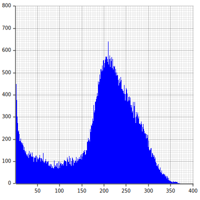

# stronghold-analysis
This repo includes some of the work I did looking at Minecraft stronghold generation last weekend. I wanted to see if strongholds were evenly distributed along the first ring, or if they were most likely to be generated in certain locations.

First, I needed to obtain a large list of strongholds. This was relatively easy, but I made it a lot more complicated than it needed to be. I found a cool repository called `cubiomes` (https://github.com/Cubitect/cubiomes) that fit the job well.

However, I wanted to try doing data analysis in rust (sue me), so I tried making some bindings for it. I spent around 3 hours messing with bindgen before I finally gave up and wrote some code in C that exported a list of stronghold locations to a text file. Its a pretty big file, so I didn't include it here but you can generate it using `lister.c`.

Now that I had my data (I started with 1 millionish samples), it was time to mess around a bit. To make sure I didn't screw anything up, I made a 200x200 array for use as a kind of frequency map (yes, I got a stack overflow before I put it in a box, shut up). I outputted it into a file (and learned about `>` vs `>>` in bash) and came up with `map.txt` (https://github.com/Dworv/stronghold-analysis/blob/main/map.txt).

Next, I made a histogram for the frequency map using `Plotters` (https://github.com/plotters-rs/plotters). That went pretty smoothly, `Plotters` is very nice. 

Finally, I wanted something out of the project that looked cool. I decided to make a map of the frequencies from above to visualize it. I need to hijack the `SVGBackend` from Plotters (they probably have an easy way to do this, but I'm too lazy to figure it out). Here it is.

.

Weirdly, there seems to be some kind of grid going on there. I wonder if that is a real feature of the generation, or simply an issue with cubiomes. Maybe I'll come back to this someday.
